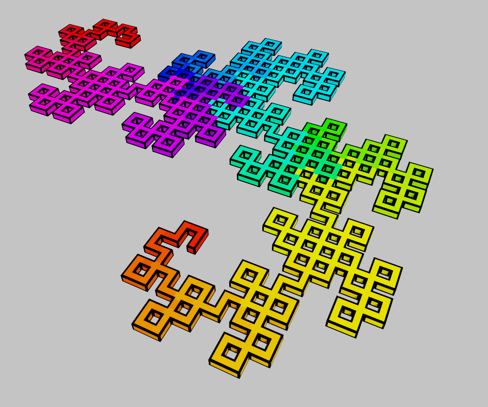

# Voxgen
[](https://crates.io/crates/voxgen)
[](https://docs.rs/voxgen)

Maintainers: [@wodend](https://github.com/wodend)

## A procedural Voxel Generation Library

Provides functions for generating
 [MagicaVoxel](https://ephtracy.github.io/)
models using popular 3D
 procedural generation techniques.

So far, only 2D L Systems are implemented, for example:


All voxel generation functions provided operate on types that implement the `VoxelBuffer` trait.

## Raw Voxel Buffers

Manipulate a buffer of voxels by setting individual voxel values.

```rust
use voxgen::buffer::{ArrayVoxelBuffer, Rgba, VoxelBuffer};

let mut vol = ArrayVoxelBuffer::new(32, 32, 32);

// Draw a simple 2D red cross and save as a MagicaVoxel .vox file.
for x in 15..=17 {
    for y in 8..24 {
        // Modify a pixel by assigning a new value to it's mutable pointer.
        *vol.voxel_mut(x, y, 0) = Rgba([255, 0, 0, 255]);
        *vol.voxel_mut(y, x, 0) = Rgba([255, 0, 0, 255]);
    }
}

vol.save("test/volumes/red_cross.vox")?;
# Ok::<(), std::io::Error>(())
```

## Turtle Graphics

Manipulate a `VoxelBuffer` using LOGO-style turtle graphics commands.

```rust
use voxgen::turtle::TurtleGraphics;

// Draw a line and save the output.
let mut turtle = TurtleGraphics::new(3, 3, 3);

// Move the turtle 1 step forward (east) without drawing.
turtle.step(1.0);

// Turn the turtle pi/2 radians left (facing north).
turtle.left(std::f32::consts::FRAC_PI_2);

// Draw a line 2 steps down the middle of the y axis.
turtle.draw(2.0);

// Save the current drawing as a magicavoxel .vox file.
turtle.buf().save("test/volumes/mid_y_line.vox").unwrap();
```

# L Systems

Inteprets L System strings and renders them using `TurtleGraphics`.

```
use voxgen::l_system::{LSystem, RenderOptions};

// Render a Koch curve.
let l_system = LSystem::new(
    "koch",
    "F-F-F-F",
    vec!["F→F-F+F+FF-F-F+F"],
);
// Builder pattern for custom rendering options.
// Default path is test/volumes/{l_system_name}_{derivation_length}.vox.
RenderOptions::new()
    .offset_x(-20.0)
    .offset_y(-20.0)
    .render(l_system);
```
